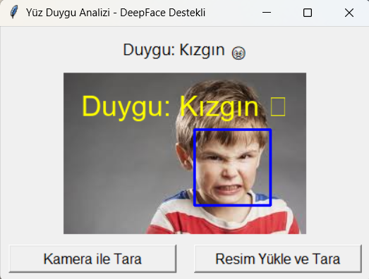
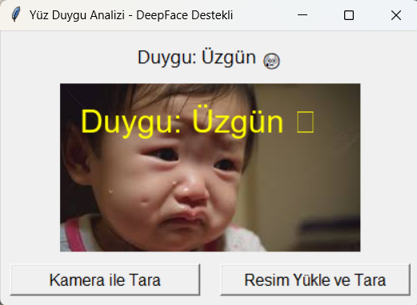
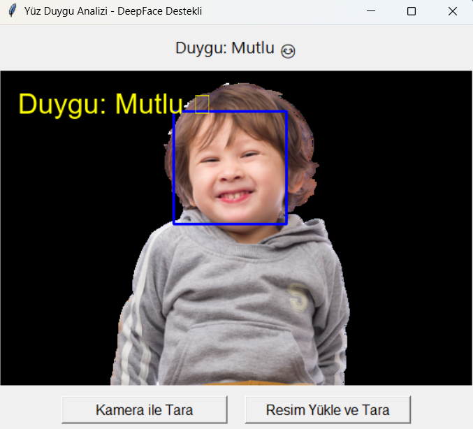

# 🧠 Yüz ve Gülümseme Tespiti Sistemi

Bu proje, OpenCV'nin Haar Cascade sınıflandırıcılarını kullanarak bir kişinin yüzünü ve gülümsemesini tespit etmeye yarayan gerçek zamanlı bir yapay zekâ uygulamasıdır.

---

## 🎯 Projenin Amacı

Bu projenin amacı, kameradan alınan görüntülerde insan yüzünü ve gülümsemeyi doğru bir şekilde tespit eden basit ve etkili bir sistem geliştirmektir. Proje, özellikle sosyal robotlar, eğlence uygulamaları ve güvenlik sistemleri gibi alanlarda kullanılabilir.

---

## 👥 Hedef Kullanıcı Kitlesi

- Yapay zekâ ve bilgisayarla görü konularına ilgi duyan öğrenciler
- İnsan davranışı analizini geliştiren yazılım geliştiriciler
- Görüntü işleme alanında araştırma yapan akademisyenler

---

## 🧰 Kullanılan Teknolojiler

- Python 3.10
- OpenCV 4.x
- Haar Cascade XML dosyaları
- NumPy

---

## ⚙️ Kurulum Adımları

```bash
# Gerekli kütüphaneleri yükleyin
pip install opencv-python numpy
```

---

## 🚀 Kullanım

```bash
python face_smile_detect.py
```

[Uygulama çalıştırıldığında bilgisayarın kamerası açılır ve ekranda yüz ile gülümseme tespit edilen alanlar kutucukla gösterilir.]

---

## 📸 Örnek Çıktılar

### 😠 Kızgın Duygu Tespiti


### 😢 Üzgün Duygu Tespiti


### 😀 Mutlu Duygu Tespiti


---

## 📁 Proje Dosya Yapısı

```plaintext
face-smile-detection/
├── face_smile_detect.py
├── haarcascade_frontalface_default.xml
├── haarcascade_smile.xml
├── outputs/
│   └── ornek_cikti.png
├── poster.pdf
├── README.md
├── requirements.txt
```

---

## 🔗GitHub Linki

[[GitHub Projesi Linki](https://github.com/Ernozkn/Yuz-goz-gulumseme-ve-duygu-tespiti)]  


---

## 👥 Katkı Yapanlar

- **Eren Özkan** – 2405902018 – Karabük Üniversitesi Bilişim Teknolojileri MYO – Yapay Zekâ Operatörlüğü

---

## 🧩 İş Bölümü

- **Eren Özkan**: [Algoritmanın geliştirilmesi, arayüz tasarımı, testler, proje bütünlüğü]

---

## 📄 Lisans

Bu proje MIT Lisansı kapsamında lisanslanmıştır.
